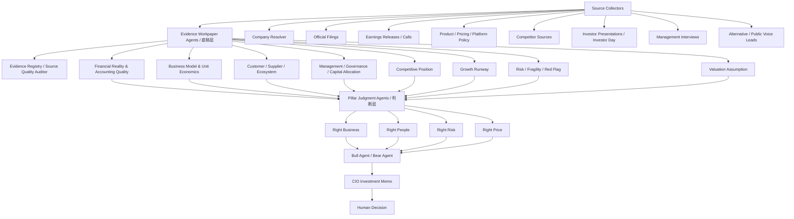

# Investment Assistant Holistic Design V1

Status: living design draft
Last updated: 2026-06-05

This document records the high-level architecture for the Investment Assistant. It is intentionally a living design document: implementation details may move, but the core research process should remain stable unless the investment process itself changes.

## Core Idea

The assistant should not be a single report generator. It should behave like a structured investment research organization:

1. collect and catalog controlled sources,
2. turn sources into reusable evidence workpapers,
3. turn evidence workpapers into pillar judgments,
4. force bull and bear debate,
5. produce a CIO-style memo,
6. support a final human decision.

The key separation is:

- Source collectors gather material and preserve provenance.
- Evidence Workpaper Agents build source-linked, question-led research workpapers.
- Judgment Agents consume multiple workpapers and make explicit investment judgments.
- The final investment decision remains human-controlled.

Evidence agents should not decide whether to buy or sell. Judgment agents should not invent facts. The final decision should remain explicit, reviewable, and separate from the evidence layer.

The current V1 workflow should be decision-question-led: build a source map first, define decision questions, create an evidence plan, extract reusable evidence, build theme workpapers, run QA / contradiction checks, triage gaps, and only then move into pillar judgment. The short design is defined in `docs/decision-question-led-evidence-workflow-v1.md`.

## High-Level Flow



## Layer 1: Source Collectors

Source collectors discover, download, cache, parse, normalize, and classify research sources. They should not write investment conclusions.

Layer 1 has a strict boundary. It only does three things:

1. find sources,
2. download / parse sources,
3. standardize source metadata.

Layer 1 is not allowed to decide whether a company is good or bad. It should not judge moat, management quality, risk attractiveness, valuation, customer happiness, or investment action. It creates the source inventory that later workpaper and judgment agents consume.

Expected source collector responsibilities:

- Resolve company identity: legal name, ticker, market, CIK or exchange identifier, listing type, currency, official IR URL, business-unit aliases.
- Collect official filings: 10-K, 20-F, annual report, 10-Q, 6-K, 8-K, exchange announcements, proxy / AGM, prospectus, material exhibits.
- Collect official event materials: earnings releases, earnings decks, earnings call transcripts, shareholder letters, official newsroom posts.
- Collect business-model sources: product pages, pricing pages, platform policy, merchant terms, seller fee pages, supply / content / infrastructure terms.
- Collect competitor sources: competitor filings, product pages, pricing pages, platform policies, investor materials.
- Collect investor presentation sources: investor day, capital markets day, conference decks, transcript where available.
- Collect management communication sources: interviews, podcasts, fireside chats, conference Q&A, YouTube transcripts when rights and quality allow.
- Collect lower-reliability leads: public voice, reviews, complaint data, social media, media, and alternative data. These are leads or hypotheses unless later validated by stronger sources.

Source tier taxonomy:

- Tier 1: Official Company Sources. Examples: 10-K, 20-F, annual report, 10-Q, 6-K, quarterly results, earnings call transcript, investor presentation, investor day, shareholder letter, official IR / newsroom release.
- Tier 2: Official External Sources. Examples: competitor filings, government / regulatory sources, court documents, exchange notices, customs or import-export data if legally available.
- Tier 3: Market / Alternative Data. Examples: app ranking, Google Trends, website traffic, product price / review count, Reddit, YouTube, TikTok, Bilibili, job postings, merchant reviews, customer reviews.
- Tier 4: Third-Party Opinions. Examples: analyst reports, news, blogs, podcasts, investment commentary.

Financial facts should normally come from Tier 1. Tier 2 can support external validation and regulatory/legal facts. Tier 3 can supply operating signals or leads. Tier 4 can supply questions or prompts for investigation, but it should not become a core fact without independent verification.

Expected output:

- `source_inventory`
- source type, source group, and source tier
- local cache path or URL
- collection status
- parse status
- source rights / usage notes when relevant
- freshness and period coverage
- section availability
- missing-source list

Every source should have stable metadata before downstream use. Minimal fields include:

```json
{
  "source_id": "pdd_2024_20f",
  "source_type": "20-F",
  "source_group": "official_company",
  "source_tier": 1,
  "issuer": "PDD Holdings Inc.",
  "period": "FY2024",
  "publication_date": "2025-04-28",
  "url": "https://www.sec.gov/...",
  "local_path": "data/sources/pdd/...",
  "collection_status": "available",
  "parse_status": "parsed",
  "sections": ["risk_factors", "mda", "financial_statements", "footnotes"]
}
```

The company input layer is part of source collection. For example, `PDD`, `PDD Holdings`, `Pinduoduo`, and `Temu` should be connected but not collapsed into the same business unit without evidence.

The detailed Layer 1 contract is defined in `docs/source-collection-layer-design-v1.md`.

## Layer 2: Evidence Workpaper Agents / 底稿层

This is the core research asset layer.

The purpose of an Evidence Workpaper Agent is not to write a polished report first. Its purpose is to create a reusable, traceable, cross-checkable workpaper package that later agents can consume.

Every Evidence Workpaper Agent should be question-led, not source-led. The output structure should be organized around fixed investment questions, while still leaving room for proactive discoveries.

Common output contract:

- `source_inventory`
- `question_pack`
- `evidence_cards`
- `claim_or_fact_registry`
- `cross_checks`
- `unknowns`
- `handoff_questions`
- `pack.json`
- `report.md`

The `pack.json` is the core asset. The `report.md` is the human-readable render.

The canonical Layer 2 design is defined in `docs/evidence-workpaper-layer-design-v1.md`.

Adopted workpaper set:

1. Financial Reality & Accounting Quality Workpaper
2. Business Model & Unit Economics Workpaper
3. Customer / Supplier / Ecosystem Workpaper
4. Management / Governance / Capital Allocation Workpaper
5. Competitive Position Workpaper
6. Growth Runway Workpaper
7. Risk / Fragility / Red Flag Workpaper
8. Valuation Assumption Workpaper

Horizontal infrastructure:

- Evidence Registry / Source Quality Auditor

### Workpaper Rules

- Source is evidence; question is structure.
- Important claims must have evidence cards with source metadata.
- Source type and reliability must be explicit.
- Filing facts, management explanations, system inferences, third-party commentary, and unknowns must remain separate.
- Weak evidence should produce uncertainty, not confident prose.
- Evidence Workpaper Agents may include a conservative preliminary read, but they should not make final investment gates.
- No Evidence Workpaper Agent should output Buy / Sell / Hold.
- Handoff questions are first-class outputs, not footnotes.

### Financial Reality & Accounting Quality Workpaper

Financial Reality & Accounting Quality is the template for this layer.

Purpose: turn trusted official disclosures into a source-linked financial workpaper.

Primary sources:

- official financial reports, 10-K, 20-F, annual report
- quarterly 10-Q or 6-K
- earnings release
- XBRL / inline XBRL
- footnotes, MD&A, risk factors, auditor and internal-control disclosures
- material-event filings when they change financial interpretation

Core workflow:

1. collect official financial sources,
2. extract numerical facts,
3. calculate financial-quality metrics,
4. create diagnostic questions,
5. investigate abnormal points by returning to official files,
6. separate filing facts, management explanations, system inferences, and still-unknown items,
7. output `financial_report_pack.json` and report during the current MVP, with `financial_reality_pack.json` as the conceptual target name.

Core questions:

1. 收入增长来自哪里？
2. 毛利率和经营利润率有没有变化？
3. 利润是否真的变成现金？
4. 现金流是否靠真实经营能力，而不是账期、押金、应付或一次性项目撑起来？
5. 增长需要消耗多少资本？
6. 资产负债表有没有压力？
7. 股权激励和摊薄是否侵蚀股东回报？
8. 最近趋势是改善、稳定还是恶化？
9. 哪些异常需要回到文件中继续解释？

Hard exclusions:

- no market-price-dependent valuation metrics
- no buy / sell / hold view
- no expected-return estimate
- no margin-of-safety conclusion
- no third-party financial database as source of truth

### Business Model & Unit Economics Workpaper

Purpose: build the evidence base for how the company makes money, who pays, why customers pay, which fees or prices matter, what costs and subsidies support the model, and where unit economics are fragile.

This is a Business Model Workpaper, not the Right Business judgment itself.

Target outputs:

- `business_model_unit_economics_pack.json`
- `business_model_unit_economics_report.md`

Current MVP implementation may write `business_model_evidence.json`; conceptually this is the same pack asset and can be renamed later if the repo standardizes pack names.

Fixed question structure:

1. How does the company make money?
2. Who pays, who uses, and who supplies?
3. Why do customers pay?
4. What drives revenue growth?
5. What drives margins and cost structure?
6. Is the model recurring, transactional, cyclical, or subsidy-driven?
7. What are the fragile points?
8. What does Financial Evidence confirm or contradict?
9. What should other agents investigate?

Important source types:

- revenue recognition notes
- segment and geography disclosure
- official product descriptions
- product pages
- pricing pages
- merchant fee / seller terms / platform policy
- earnings releases and earnings calls
- investor presentations and investor day
- competitor filings
- competitor product / pricing / policy sources
- financial evidence workpaper output

The flow should be:

```text
Business Model Sources
    ↓
Business Model & Unit Economics Workpaper
  ↓
Competitive Position / Growth / Risk / Valuation Assumption / Management handoff questions
  ↓
Right Business Agent
```

### Customer / Supplier / Ecosystem Workpaper

Purpose: validate whether the ecosystem participants around the business also have reasons to keep participating.

This workpaper is especially important for platforms, marketplaces, consumer internet, advertising ecosystems, cloud ecosystems, app ecosystems, payment networks, and distributor/supplier-heavy businesses.

Target outputs:

- `ecosystem_evidence_pack.json`
- `ecosystem_evidence_report.md`

Fixed question structure:

1. Who are the important ecosystem participants?
2. What problem does the company solve for each participant?
3. Are customers satisfied enough to repeat?
4. Are suppliers, merchants, advertisers, developers, publishers, logistics partners, or other counterparties economically healthy?
5. Does one side of the ecosystem subsidize another side?
6. Do platform rules, fees, penalties, return policies, or data policies create hidden fragility?
7. Are complaints isolated, cyclical, or structural?
8. What should Business Model, Competitive Position, Growth, and Risk investigate next?

Important source types:

- product pages and product flows
- pricing / membership / fee pages
- merchant / seller / supplier terms
- platform policy pages
- app store reviews and ratings
- customer support and complaint sources
- merchant / supplier forums and complaints
- developer / publisher / advertiser docs
- official regulator and consumer-protection sources
- alternative data signals, labeled as lead or pattern evidence

### Management / Governance / Capital Allocation Workpaper

Purpose: build the evidence base for who controls the company, how incentives work, whether communication is credible, and whether governance creates owner risk.

This is a Management Workpaper, not the Right People judgment itself.

Target outputs:

- `management_governance_capital_allocation_pack.json`
- `management_governance_capital_allocation_report.md`

Fixed question structure:

1. Who controls the company?
2. Are incentives aligned with outside shareholders?
3. What is the capital allocation record?
4. Is management communication direct, specific, and consistent?
5. Did management promises later match results?
6. Are there governance, audit, related-party, ownership, or integrity red flags?
7. What does Financial Evidence confirm or contradict about capital allocation and per-share value creation?
8. What should Right People, Risk, and Valuation investigate next?

Important source types:

- proxy / AGM / shareholder meeting materials
- annual report governance section
- ownership and voting disclosures
- compensation disclosures
- related-party transaction disclosures
- board and committee disclosures
- earnings call Q&A
- investor day / conference Q&A
- management interviews and podcasts
- capital allocation history from financial workpaper

### Competitive Position Workpaper

Purpose: collect evidence about competitors, substitutes, price pressure, product parity, distribution, cost structure, and copyability.

It should not simply declare that the company has a moat. `Moat` is a downstream judgment. This workpaper organizes evidence for and against competitive-position hypotheses such as network effects, switching costs, scale economies, brand, data advantages, regulatory barriers, supply advantages, ecosystem lock-in, or cost advantages.

Expected outputs:

- competitive-position hypotheses
- supporting evidence
- disconfirming evidence
- competitor evidence
- product / pricing / policy comparison
- durability risks
- handoff questions to Right Business and Risk

### Growth Runway Workpaper

Purpose: collect evidence about future growth sources and whether growth can be valuable.

Expected outputs:

- market size and penetration evidence
- product expansion evidence
- geography expansion evidence
- pricing / ARPU / take-rate evidence
- reinvestment opportunity evidence
- growth quality cross-checks against Financial Evidence
- saturation and constraint evidence
- handoff questions to Right Business, Right Price, and Risk

### Risk / Fragility / Red Flag Workpaper

Purpose: collect and classify downside evidence before the judgment layer.

Expected outputs:

- business risk map
- financial risk map
- governance and ownership risk
- regulatory / legal risk
- cyclical and macro risk
- platform / supplier / customer concentration risk
- kill-risk candidates
- unknowns and unresolved evidence gaps

Risk / Fragility / Red Flag may rank severity preliminarily, but the final survivability and compensation judgment belongs to Right Risk.

### Valuation Assumption Workpaper

Purpose: prepare valuation inputs and scenario evidence without making the final Right Price gate by itself.

Expected outputs:

- owner earnings and free cash flow inputs
- reinvestment assumptions
- capital intensity assumptions
- scenario drivers
- sensitivity map
- market-implied expectation inputs when allowed
- links back to Financial, Business Model, Growth, Risk, and Management workpapers

The Right Price Agent owns the final judgment about expected return, margin of safety, and whether price is attractive.

## Layer 3: Pillar Judgment Agents / 判断层

Pillar Judgment Agents consume multiple workpaper packs and produce explicit judgments. They should show what is supported, partially supported, contradicted, or unknown.

Judgment agents can make calls that workpaper agents should not make. However, every judgment must cite the workpaper evidence it depends on.

### Evidence Agent vs Judgment Agent

| Agent type | Goal | Output | Allowed judgment |
| --- | --- | --- | --- |
| Evidence / Workpaper Agent | Organize facts, claims, evidence, cross-checks, unknowns, and handoff questions | `pack.json` plus `report.md` | Conservative preliminary read only |
| Judgment Agent | Consume multiple workpapers and decide whether an investment pillar is attractive, weak, risky, or uncertain | pillar judgment pack and memo section | Yes, but only with cited workpaper support |

### Right Business

Question: Is this a business we can understand, and does it have attractive economics through a cycle?

Inputs:

- Financial Reality & Accounting Quality Workpaper
- Business Model & Unit Economics Workpaper
- Customer / Supplier / Ecosystem Workpaper
- Competitive Position Workpaper
- Growth Runway Workpaper
- Risk / Fragility / Red Flag Workpaper

Outputs:

- business quality judgment
- durability judgment
- economic engine diagnosis
- key business-model risks
- evidence gaps
- required follow-up questions

### Right People

Question: Are the people in control likely to increase per-share intrinsic value while treating outside owners fairly?

Inputs:

- Management / Governance / Capital Allocation Workpaper
- Financial Reality & Accounting Quality Workpaper
- Risk / Fragility / Red Flag Workpaper
- Business Model & Unit Economics Workpaper when control or incentive issues affect the model

Outputs:

- control and governance judgment
- incentive alignment judgment
- capital allocation judgment
- communication credibility judgment
- red-flag status

### Right Risk

Question: Are the risks understandable, survivable, and appropriately compensated?

Inputs:

- Risk / Fragility / Red Flag Workpaper
- Financial Reality & Accounting Quality Workpaper
- Business Model & Unit Economics Workpaper
- Customer / Supplier / Ecosystem Workpaper
- Management / Governance / Capital Allocation Workpaper
- Competitive Position Workpaper
- Right Business and Right People judgments when available

Outputs:

- major risk map
- kill-risk list
- risk mitigants
- survivability judgment
- risk-adjusted confidence level

### Right Price

Question: Is the current price attractive relative to conservative intrinsic value and expected return?

Inputs:

- Valuation Assumption Workpaper
- Financial Reality & Accounting Quality Workpaper
- Right Business judgment
- Right People judgment
- Right Risk judgment

Outputs:

- expected return range
- margin of safety
- what must be true at current price
- downside case
- valuation sensitivity
- price attractiveness judgment

## Layer 4: Bull Agent / Bear Agent

The bull and bear agents should debate the same evidence rather than use separate unsupported narratives.

Bull Agent:

- Builds the strongest long thesis from available evidence.
- Identifies what the market may be missing.
- Explains why concerns may be temporary, priced in, or misunderstood.

Bear Agent:

- Builds the strongest short / avoid thesis from available evidence.
- Identifies accounting, governance, business-model, and valuation failure modes.
- Explains what could permanently impair intrinsic value.

Both agents must cite workpaper packs and pillar judgments. Neither agent should invent new facts.

## Layer 5: CIO Investment Memo

The CIO memo should synthesize the debate into a decision-ready research artifact.

Expected structure:

- one-page summary
- current recommendation posture
- thesis
- anti-thesis
- key evidence
- key unknowns
- valuation and expected return
- risk controls
- what would change the decision

The CIO memo should be written for a human investor who wants clarity, not volume.

## Layer 6: Human Decision

The final decision is a human-controlled investment decision.

Possible outputs:

- Research only.
- Watchlist.
- Pass.
- Buy / add.
- Hold.
- Reduce / sell.
- Needs more work.

The system should make clear which parts are evidence, which parts are judgment, and which parts require human decision.

## Design Principles

The detailed operating principles are defined in `docs/research-operating-principles-v1.md`.

- Source control first: official filings and controlled sources should be clearly separated from third-party or public voice sources.
- Broad before deep: establish source coverage before drilling into one retrieval result.
- Question before extraction: define questions and evidence plan before extracting evidence.
- Evidence before prose: no major claim should appear without traceable source support.
- Evidence before conclusion: unsupported judgments are hypotheses, not conclusions.
- Question-led bottom-up research: each workpaper answers fixed investment questions, not source summaries.
- Mechanism before metric: numbers should be connected to the economic mechanism behind them.
- Contradiction before confidence: high confidence requires counterevidence and contradiction checks.
- Gap before next step: each answer should disclose what remains unanswered and whether more digging is worthwhile.
- Facts, claims, management explanations, system inferences, and unknowns should remain separate.
- `pack.json` is the reusable machine asset; `report.md` is the human render.
- Agents should have narrow responsibilities.
- Judgment should be staged, not mixed into extraction.
- Human decision points should be explicit when source trust, valuation assumptions, or portfolio action is involved.
- The final output should be readable enough to support actual investment decisions.

## Open Design Questions

- What exact shared schema should every Evidence Workpaper pack implement?
- Which workpaper agents are mandatory before each Pillar Judgment Agent is allowed to run?
- Which workpapers are mandatory before Right Business is allowed to run?
- Should Competitive Position contain all moat hypotheses, or should Right Business own the final moat synthesis entirely?
- How far should the Valuation Assumption Workpaper go before the Right Price Agent takes over?
- What minimum evidence is required before Bull / Bear debate is allowed?
- Which decisions require human approval before the system introduces non-official data sources?
- How should management interviews and YouTube transcripts be collected, labeled, and summarized without over-promoting management narrative into facts?
- Should current artifact names be standardized across Financial Reality, Business Model, Ecosystem, Management, Competitive Position, Growth, Risk, and Valuation Assumption workpapers?

## Related Documents

- `docs/evidence-workpaper-layer-design-v1.md`
- `docs/source-collection-layer-design-v1.md`
- `docs/research-operating-principles-v1.md`
- `docs/decision-question-led-evidence-workflow-v1.md`
- `docs/mvp-prototype-contract-v1.md`
- `docs/business-model-unit-economics-workpaper-design-v1.md`
- `docs/financial-agents-v1.md`
- `docs/business-model-moat-agent-v1.md`
- `docs/business-model-data-source-coverage-tracker-v1.md`
- `docs/evidence-and-communication-extraction-design-v1.md`
- `docs/right-people-agent-v1.md`
- `docs/valuation-methodology-v1.md`
- `docs/human-involved-decision-points.md`
- `docs/stock-research-multi-agent-requirements.md`
- `docs/technical-architecture-v1.md`

## Change Log

- 2026-06-05: Added the MVP Prototype Contract V1 as the practical build contract for section-by-section implementation.
- 2026-06-05: Added the short Decision-Question-Led Evidence Workflow V1 design and linked it from the holistic design.
- 2026-06-05: Added the research operating principles document and linked the six core process principles into the holistic design.
- 2026-06-05: Hardened Layer 1 as a pure source collection layer, added source tier taxonomy, and linked the dedicated source collection design.
- 2026-06-04: Added the canonical Layer 2 workpaper design reference and updated the workpaper list to 8 workpapers plus Evidence Registry.
- 2026-06-04: Reframed the system around Source Collectors, Evidence Workpaper Agents / 底稿层, Pillar Judgment Agents / 判断层, Bull/Bear debate, CIO memo, and Human Decision.
- 2026-06-01: Created V1 holistic design draft from user-provided architecture.
