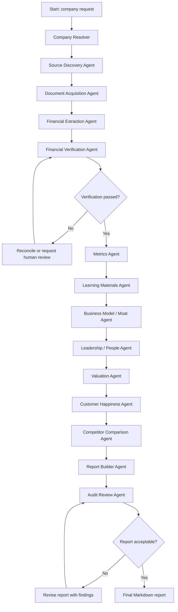
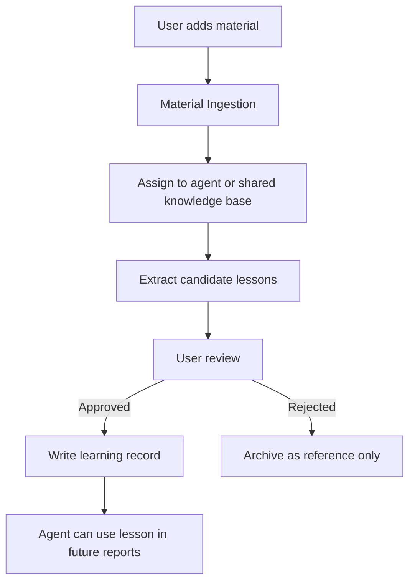

# Stock Research Multi-Agent System: V1 Technical Architecture

## 1. Goal

Build a CLI-first multi-agent research system for deep value-investing research.

V1 should prove the most important workflow:

1. Start with one company.
2. Find official and high-quality public sources.
3. Extract financial facts with citations.
4. Cross-check important numbers.
5. Calculate metrics once the user provides formula preferences.
6. Produce an auditable Markdown report.

The first prototype target should be PDD Holdings.

## 2. Core Technology Choices

### 2.1 Language

Use Python for V1.

Reasons:

- Strong LangChain and LangGraph ecosystem support.
- Good document parsing libraries.
- Good financial data and table-processing ecosystem.
- Easy CLI development.
- Easy future path to a local web app.

### 2.2 Agent Orchestration

Use LangGraph for the multi-agent workflow.

LangGraph is the right fit because the system needs:

- Explicit graph state.
- Durable multi-step workflows.
- Human review points.
- Retry and verification loops.
- Agent-by-agent audit trails.
- Future support for long-running monitoring jobs.

Human review points should be treated as explicit workflow gates, not informal chat pauses. The living decision-point registry is `docs/human-involved-decision-points.md`.

Use LangChain for:

- OpenAI model integration.
- Tool abstractions.
- Document loading and parsing.
- Retrieval over source documents and learning materials.
- Structured output helpers.

### 2.3 LLM Provider

Use OpenAI first through LangChain's `langchain-openai` integration.

The code should isolate model construction behind a provider factory so future providers can be added without rewriting every agent.

Example internal design:

```text
src/stock_research/llm/provider.py
  create_chat_model(task: str) -> BaseChatModel
```

Different tasks may eventually use different model settings:

- Extraction: lower temperature, structured output.
- Qualitative research: broader reasoning.
- Audit: strict, skeptical, evidence-first.
- Report writing: clear synthesis, no unsupported claims.

## 3. V1 Interface

Start with a command-line tool.

Initial commands:

```bash
stock-research init
stock-research research --company PDD --market us-adr
stock-research research --company GOOGL --market us
stock-research research --company TCEHY --market us-adr
stock-research research --company 0700.HK --market hk
stock-research lessons
stock-research monitor
stock-research list-runs
stock-research show-run <run_id>
```

For V1, the first command we actually need to implement is:

```bash
stock-research research --company PDD --market us-adr
```

V1 report output should be Markdown only. PDF, Word, Google Docs, and dashboard exports are future options after the core research workflow is reliable.

The report should be bilingual and end with a right business model / right people / right price checklist. V1 should not produce a final investment conclusion yet.

## 4. High-Level Workflow

The V1 workflow should be a LangGraph state graph.



## 5. LangGraph State

The graph should pass a typed state object between nodes.

Suggested V1 state fields:

```python
class ResearchState(TypedDict):
    run_id: str
    company_query: str
    canonical_company: CompanyIdentity | None
    market: str
    requested_years: int
    source_candidates: list[SourceCandidate]
    approved_sources: list[SourceRecord]
    documents: list[DocumentRecord]
    extracted_facts: list[FinancialFact]
    verification_results: list[VerificationResult]
    metrics: list[MetricResult]
    learning_context: dict
    business_model_findings: dict
    leadership_findings: dict
    valuation_findings: dict
    customer_happiness_findings: dict
    competitor_findings: dict
    agent_reports: list[AgentReport]
    final_report_path: str | None
    audit_events: list[AuditEvent]
    errors: list[WorkflowError]
    human_review_required: bool
```

State should be saved after each major node so a run can be inspected or resumed.

For V1, JSON files are enough. Later, move to SQLite when state querying becomes important.

## 6. Initial Agents

### 6.1 Company Resolver

Purpose:

Convert user input into a canonical company identity.

Input examples:

- `GOOGL`
- `Alphabet`
- `Google`
- `0700.HK`
- `Tencent`
- `PDD`

Output:

The Company Resolver should output more than a ticker lookup. It should create the identity package that every downstream agent uses to avoid ambiguity.

Minimum V1 output:

- Company legal name.
- Common names and aliases.
- Ticker symbols.
- Market.
- Exchange.
- Listing type, such as common stock, ADR, H-share, or A-share.
- SEC CIK if available.
- Primary regulator or exchange disclosure system.
- Filing systems to use.
- Known investor relations URL if available.
- Official annual report URL pattern or document hub if known.
- Reporting currency.
- Trading currency.
- Fiscal year end.
- Company domicile and main operating geography.
- Listing date or public-company history start date if available.
- Source-priority profile for the company.
- Known structural notes, such as ADR, VIE, holding-company structure, or major subsidiaries.
- Language expectations for sources, such as English, Chinese, or both.

V1 for PDD:

- Resolve `PDD` to PDD Holdings Inc.
- Resolve CIK from SEC ticker mapping if available.
- Prefer SEC filings, official annual reports, and PDD investor relations as primary financial sources.
- Track that PDD is a Chinese-origin company listed as a U.S. ADR, so the system should preserve ADR/company-structure context.
- Track reporting and trading currency separately if they differ.
- Track source-language expectations because PDD research may need English filings plus Chinese qualitative sources.

### 6.2 Source Discovery Agent

Purpose:

Find candidate source documents.

For U.S. companies:

- SEC submissions API.
- SEC company facts API.
- SEC filing archive.
- Company investor relations annual reports and earnings releases.

For Hong Kong / Chinese companies later:

- HKEXnews listed company document search.
- Company investor relations pages.
- Annual reports in English and Chinese when available.
- SEC filings for ADRs or foreign private issuers, if applicable.

Output:

- Candidate sources with source type, URL, date, period, filing type, trust tier, and reason selected.

Trust tiers:

- Tier 1: Official Company Sources. Examples: SEC / exchange filings authored by the issuer, company annual reports, quarterly results, earnings releases, official earnings transcripts, investor presentations, shareholder letters, and official IR / newsroom releases.
- Tier 2: Official External Sources. Examples: competitor filings, government or regulatory sources, court documents, exchange notices, and customs or import-export data if available and legally usable.
- Tier 3: Market / Alternative Data. Examples: app ranking, Google Trends, website traffic, product prices, review counts, Reddit, YouTube, TikTok, Bilibili, job postings, merchant reviews, and customer reviews.
- Tier 4: Third-Party Opinions. Examples: analyst reports, news, blogs, podcasts, and investment commentary.

V1 should use Tier 1 as the primary source for financial numbers. Tier 2 can cross-check official external facts. Tier 3 and Tier 4 can generate leads or questions, but they should not enter the core financial fact layer without explicit validation and source labeling.

### 6.3 Document Acquisition Agent

Purpose:

Download, cache, and fingerprint source documents.

Responsibilities:

- Fetch filing metadata.
- Download HTML, PDF, JSON, XBRL, or text documents.
- Store raw copies locally.
- Compute checksum.
- Record fetch time and source URL.
- Respect source rate limits and terms.

Important policy:

SEC access must use a declared `User-Agent` and respect fair-access limits.

V1 should use a conservative local rate limit well below SEC's stated maximum.

### 6.4 Financial Extraction Agent

Purpose:

Extract financial facts from official documents.

V1 extraction strategy:

1. Prefer structured SEC XBRL company facts when available.
2. Use filing HTML or annual-report tables as secondary extraction sources.
3. Preserve exact source fields and units.
4. Normalize facts into a common internal schema.

Example fact schema:

```python
class FinancialFact(BaseModel):
    company_id: str
    fiscal_year: int
    fiscal_period: str
    statement: Literal["income_statement", "balance_sheet", "cash_flow", "other"]
    concept: str
    label: str
    value: Decimal
    unit: str
    scale: int | None
    source_url: str
    source_document_id: str
    source_page_or_section: str | None
    accession_number: str | None
    extracted_by_agent: str
    confidence: float
```

Important:

The LLM should not be trusted to invent numbers. It should extract from source text/tables or reconcile structured records produced by deterministic parsers.

### 6.5 Financial Verification Agent

Purpose:

Independently verify key facts.

Verification methods:

- Compare XBRL company facts against the same company's filing HTML.
- Compare annual report values against 10-K values.
- Compare current-year values against prior-year values disclosed in the next year's filing.
- Compare against official investor relations PDF tables when available.
- Use secondary free sources only as weak confirmation, clearly labeled.

Verification result schema:

```python
class VerificationResult(BaseModel):
    fact_id: str
    status: Literal["verified", "mismatch", "missing_secondary_source", "needs_human_review"]
    checked_sources: list[str]
    expected_value: Decimal | None
    observed_values: list[ObservedValue]
    explanation: str
    severity: Literal["info", "warning", "critical"]
```

Rules:

- Key facts with critical mismatches should block the final report.
- Small differences due to rounding should be allowed but recorded.
- Restatements must be flagged, not silently overwritten.

### 6.6 Metrics Agent

Purpose:

Calculate value-investing metrics from verified facts.

V1 placeholder:

The metrics agent should wait for the user's metrics document before finalizing the first formula set.

Current design:

- Keep formula implementation in deterministic Python as the single source of truth.
- Keep formula explanations in docs near the agent instructions.
- Do not keep a parallel formula JSON/YAML config unless runtime code actually reads it.
- Use LLM only to explain interpretation and limitations.

The previous idea of a separate formula YAML/JSON registry was removed because it created a second source of truth.

### 6.7 Report Builder Agent

Purpose:

Build the final Markdown report.

Report sections for V1:

- Company identity.
- Run metadata.
- Source inventory.
- Extracted financial facts.
- Verification summary.
- Metrics summary.
- Audit trail.
- Open questions.
- Known limitations.

The report must distinguish:

- Facts extracted directly from source documents.
- Calculations performed by the system.
- Agent interpretations.
- Unverified or lower-confidence claims.

### 6.8 Audit Review Agent

Purpose:

Act as a skeptical reviewer before final output.

Checklist:

- Are all important numbers cited?
- Are formulas identified by version?
- Are mismatches visible?
- Are unsupported claims removed or labeled?
- Are source trust tiers visible?
- Are unresolved issues listed?
- Did any agent use disallowed sources?

The audit agent should produce:

- Pass/fail result.
- Required changes.
- Optional improvements.
- Residual risk note.

## 7. Data Storage

Use local file storage for V1.

Suggested directory layout:

```text
stock-research-system/
  pyproject.toml
  README.md
  .env.example
  config/
    agents/
    formulas/
    source_policy.yaml
  data/
    raw/
      filings/
      reports/
      qualitative/
    processed/
      facts/
      metrics/
      verification/
    runs/
      <run_id>/
        state.json
        audit_log.jsonl
        final_report.md
        agent_reports/
    knowledge/
      materials/
      extracted_lessons/
      agent_learning_records/
  docs/
  src/
    stock_research/
      cli.py
      graph.py
      state.py
      agents/
      sources/
      extraction/
      verification/
      metrics/
      reports/
      storage/
      llm/
  tests/
```

V1 should store:

- Raw downloaded source documents.
- Parsed document text/tables.
- Extracted financial facts.
- Verification records.
- Agent reports.
- Final report.
- Audit log.

## 8. Source Policy

Create a source policy config file.

```yaml
financial_numbers:
  allowed_primary:
    - sec_filing
    - sec_xbrl_companyfacts
    - company_investor_relations
    - hkex_disclosure
  allowed_secondary:
    - reputable_free_financial_database
  disallowed_as_primary:
    - yahoo_finance
    - reddit
    - youtube
    - bilibili
    - social_media
    - blogs

qualitative_research:
  allowed:
    - company_filings
    - earnings_calls
    - shareholder_letters
    - interviews
    - youtube
    - bilibili
    - reddit
    - forums
    - app_reviews
  require_source_quality_label: true
```

V1 should enforce this policy in code before agents are allowed to use a source for a claim.

## 9. Agent Learning System

Learning should be controlled, explicit, and auditable.

V1 learning flow:



Learning record schema:

```python
class LearningRecord(BaseModel):
    record_id: str
    agent_id: str
    material_id: str
    lesson_summary: str
    extracted_rules: list[str]
    affects: list[Literal["source_policy", "formula", "interpretation", "report_template", "checklist"]]
    status: Literal["candidate", "approved", "rejected", "retired"]
    approved_by_user: bool
    created_at: datetime
```

Important:

Agents should not silently update formulas, source policies, or investment rules. Human approval should be required before a learning record becomes active.

User-confirmed rule:

- Learning materials can produce candidate lessons.
- Candidate lessons stay inactive until the user approves them.
- Approval is required before a candidate lesson changes formulas, checklists, source policy, interpretation rules, or report templates.

## 10. Report Output Standard

Every agent report should include:

- Agent name.
- Task.
- Inputs.
- Sources used.
- Work performed.
- Key findings.
- Evidence.
- Confidence.
- Limitations.
- Follow-up questions.

Every final company report should include:

- Executive summary.
- Source inventory.
- Financial extraction table.
- Verification table.
- Metrics table.
- Audit section.
- Open questions.
- Appendix with raw source links.

## 11. Human Review Gates

V1 should include human review gates for:

- Critical financial mismatches.
- Missing primary sources.
- Formula changes.
- Learning-record activation.
- New trusted-source additions.
- Low-confidence final conclusions.
- Source conflicts.
- Proposed use of low-quality sources for important claims.
- Important valuation assumptions that materially affect the conclusion.

Financial verification should treat mismatches above 2% as material. Rounding differences can be accepted automatically when clearly explained and logged.

For CLI V1, human review can be simple:

```text
This run requires review:
  - Revenue in FY2023 differs between source A and source B.
  - Difference: 0.8%.
Continue with rounded value from 10-K? [y/N]
```

Later, this can become a local web review screen.

The default behavior should be conservative. If the user does not approve, the system should either stop the run, mark the affected conclusion as unresolved, or continue only with a clearly labeled limitation.

## 12. Quality Bar

V1 should be considered successful when:

- The system can run on PDD Holdings.
- It can identify the company and retrieve SEC, PDD investor relations, and other official/public sources.
- It can extract a small set of financial facts with citations.
- It can independently verify those facts.
- It can produce a Markdown report that clearly separates facts, calculations, and interpretation.
- It can show an audit log for the run.
- It can fail gracefully when a source is missing or a number cannot be verified.

V1 watchlist should be limited to:

- PDD Holdings.
- Google / Alphabet.
- Tencent.

Deep research should start with PDD. Google / Alphabet and Tencent can be used for watchlist monitoring, future comparison, and later workflow expansion.

Watchlist monitoring should eventually run weekly. V1 triggers are new filing and management change only.

V1 should not be considered successful if:

- It produces numbers without source links.
- It silently uses low-quality sources for financial data.
- It hides mismatches.
- It makes valuation or moat conclusions without evidence.
- It cannot reproduce a previous run.

## 13. Testing Strategy

Initial tests:

- Company resolver resolves `PDD` to PDD Holdings and SEC CIK where available.
- Source discovery finds recent PDD annual reports / 20-F or equivalent official filings.
- SEC client respects configured rate limit and user agent.
- Fact extraction maps common XBRL concepts to internal concepts.
- Verification flags mismatch cases.
- Metrics calculations are deterministic.
- Report builder includes required sections.
- Audit agent blocks unsupported claims.

Fixture strategy:

- Store small sample SEC JSON responses and filing excerpts in test fixtures.
- Avoid live network calls in unit tests.
- Use integration tests separately for live SEC access.

## 14. V1 Implementation Phases

### Phase 1: Skeleton

- Create Python project.
- Add CLI entrypoint.
- Add config loading.
- Add run directory creation.
- Add typed state models.
- Add minimal LangGraph workflow with placeholder agents.

### Phase 2: PDD / U.S. ADR Source Pipeline

- Add SEC ticker to CIK resolver.
- Add SEC submissions fetcher.
- Add SEC company facts fetcher.
- Add source records and raw caching.
- Add conservative rate limiting.
- Add PDD investor relations source discovery.
- Track ADR and Chinese operating-company context.
- Index all available PDD filing metadata.
- Download/cache real financial reports, especially all available 20-F annual reports and important 6-K financial-result filings.

### Phase 3: Extraction and Verification

- Map initial financial concepts.
- Extract key facts for PDD.
- Add verification rules.
- Add mismatch reporting.
- Initial facts: revenue, gross profit, operating income, net income, operating cash flow, CapEx, free cash flow, cash, debt, stock-based compensation, diluted shares / ADS context, total assets, and total liabilities.
- Extract both annual fiscal-year data and quarterly data from relevant 6-Ks.

### Phase 4: Reports

- Generate agent reports.
- Generate final Markdown report.
- Generate audit log.

### Phase 5: Metrics

- Ingest user-provided metrics document.
- Implement first formulas directly in deterministic Python.
- Add deterministic metric calculations.
- Add interpretation layer.

Initial metric requirements are captured in:

- `docs/metrics-formula-requirements-v1.md`

The first formula implementation should prioritize Owner Earnings, Enterprise Value, True Yield, Cash Conversion Ratio, Five-Year One-Dollar Test, and Unlevered ROIC.

Confirmed V1 metric behavior:

- Owner Earnings uses D&A as the initial maintenance CapEx approximation.
- Enterprise Value subtracts all cash first, while flagging excess-cash limitations.
- ROIC is calculated but no threshold is applied.

### Phase 6: Bilingual Markdown Report

- Produce a bilingual Markdown report.
- Include source inventory, financial tables, verification, metrics, audit notes, and open questions.
- End with right business model / right people / right price checklist.
- Do not produce a final investment conclusion yet.

### Phase 7: Learning-Material Ingestion

- Ingest the user's Google Drive investment notes.
- Group candidate lessons by agent.
- Use statuses: `candidate`, `approved`, `rejected`, `retired`.
- Only approved lessons can change behavior.

### Phase 8: Watchlist Monitoring Skeleton

- Weekly monitoring for PDD, Tencent, and Google / Alphabet.
- Triggers: new filing and management change.
- No price-drop trigger for now.

### Phase 9: Tencent Expansion

- Add Tencent and PDD company identity records.
- Add HKEXnews source discovery for Tencent.
- Expand SEC/ADR source handling for PDD beyond the V1 financial extraction path.
- Add Chinese-language document handling.
- Add bilingual source metadata.

### Phase 10: Google Expansion

- Add Google / Alphabet company identity.
- Add SEC and Alphabet IR source handling.

### Phase 11: Full Research Agents

Implement separate non-financial agents in this order:

1. Business Model / Moat Agent.
2. Leadership / People Agent.
3. Valuation Agent.
4. Customer Happiness Agent.
5. Competitor Comparison Agent.

## 15. Important Implementation References

Official references to use during implementation:

- LangGraph overview: https://docs.langchain.com/oss/python/langgraph/overview
- LangChain OpenAI integration: https://docs.langchain.com/oss/python/integrations/chat/openai
- LangChain document loaders: https://docs.langchain.com/oss/python/integrations/document_loaders/
- SEC data APIs: https://data.sec.gov/
- SEC EDGAR data access guidance: https://www.sec.gov/search-filings/edgar-search-assistance/accessing-edgar-data
- HKEXnews listed company document search: https://www.hkexnews.hk/homelcicontentsearch.html
